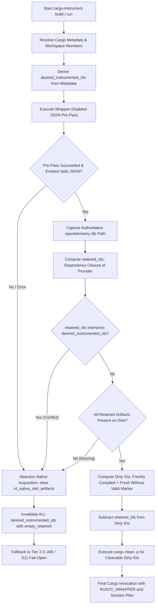

# P2.4 / H1 — Native R-4 Production Orchestration & Incomplete Pre-Pass Recovery

**Status:** H1 RESOLVED.  
**Acceptance Baseline:** [`p2.4-validation-audit.md`](p2.4-validation-audit.md) (historical baseline preserved).  
**Related Documents:** [ADR-011 (Hybrid Fallback)](../decision-records.md#adr-011---the-tier-2-c-abi-is-provisional), [`r4-extern-injection-spike.md`](r4-extern-injection-spike.md), [`tokio-spawn-propagation.md`](tokio-spawn-propagation.md).

---

## 1. Executive Summary

Milestone H1 establishes production-grade, ordinary CLI orchestration for native R-4 OpenTelemetry dependency injection (`cargo instrument build` and `cargo instrument run`). It eliminates the requirement for manual session plans or pre-populated artifact paths, allowing dependency compilation units without an `opentelemetry` dependency in their manifest to receive native `--extern opentelemetry=<rlib>` injection.

Following the initial H1 review, a critical correctness issue was identified and resolved:
> **Incomplete Pre-Pass Vulnerability:** When the same-target Cargo JSON pre-pass fails mid-build (e.g. compile error in the binary, syntax error, or process termination) or emits truncated/malformed JSON, uninstrumented dependency artifacts already written to `target/` could be omitted from Cargo's JSON stream. Relying solely on the pre-pass JSON stream to identify dirty packages would allow these uninstrumented artifacts to persist into subsequent wrapper invocations, silently bypassing telemetry instrumentation.

This document details the confirmed root cause, the architecture of the complete invalidation recovery mechanism, the full 13-test regression matrix in [`r4_production_orchestration_tests.rs`](../../../cargo-instrument/tests/r4_production_orchestration_tests.rs), and empirical validation results across the workspace.

```text
H1 native R-4 production orchestration  RESOLVED
H2 feature-safe native selection        PARTIAL / outstanding
H3 Tokio package identity               PARTIAL / outstanding
Cross-target and all-target CLI modes   wrapper-only behavior retained
Overall P2.4 production hardening       INCOMPLETE
```

---

## 2. Root Cause Analysis: Incomplete Pre-Pass Output

### 2.1 The Vulnerability

In ordinary CLI invocations, `cargo-instrument` executes a wrapper-disabled same-target pre-pass with `--message-format=json` to discover the exact `opentelemetry` `.rlib` artifact compiled by Cargo for the target profile. Following the pre-pass:
1. Newly compiled or fresh dependencies must be invalidated via `cargo clean -p <name>` so that the subsequent wrapper pass re-compiles them through `RUSTC_WRAPPER`.
2. Packages forming the dependency closure of the retained `opentelemetry` artifact must *not* be cleaned, ensuring the captured `.rlib` remains intact.

Prior to this fix, the invalidation planner computed dirty instrumented packages by filtering `package_id` entries parsed from the pre-pass stdout (`freshly_compiled_package_ids` and `uninstrumented_fresh_package_ids`).

If the pre-pass exited prematurely due to:
- A syntax or type error in the root application or an intermediate package,
- A truncated or corrupted stdout stream (malformed JSON),
- An unhandled build interruption,

then dependency packages compiled before the failure would exist on disk as uninstrumented `.rlib` files, but their compiler-artifact messages might never have been emitted or successfully parsed. Consequently, the selective invalidation planner would not recognize them as dirty, would not clean them, and would allow uninstrumented binaries to be linked into the final target.

### 2.2 Mechanism of the Fix

The orchestration logic in [`cargo-instrument/src/main.rs`](../../../cargo-instrument/src/main.rs) was hardened to prevent any reliance on partial pre-pass output:

1. **Metadata-Driven Desired Set:**
   The full set of packages desired for instrumentation (`desired_instrumented_ids`) is derived strictly from Cargo metadata (`desired_instrumented_package_ids(plan, &metadata)`) before inspecting the pre-pass outcome.
2. **Native Abandonment on Failure:**
   If `output.status.success() == false` or `plan.add_r4_artifacts_from_cargo_json` fails with incomplete/malformed output, native acquisition is immediately abandoned (`plan.r4_native_otel_artifacts.clear()`).
3. **Full Desired Set Invalidation with Empty Retained Set:**
   Because native injection is abandoned, no OpenTelemetry artifact needs to be preserved. An `empty_retained` set is supplied to `invalidate_packages(&desired_instrumented_ids, &empty_retained, ...)`. Every package in the desired instrumentation set is invalidated, guaranteeing that partially-compiled dependencies are thoroughly purged.
4. **S11 Fail-Open Integration:**
   When native acquisition falls back to Tier-2 C-ABI injection, per-unit wrapper policy checks whether the target root provides the `otel-shim` provider symbols. If no provider is present in the build, dependencies recompiled by the wrapper safely skip transformation per S11 fail-open rules (exit code 0, emitting clean diagnostics), rather than causing link-time symbol errors.

---

## 3. Orchestration Architecture & Invalidation Logic

The hardened native artifact acquisition workflow (`acquire_native_artifacts`) operates as follows:



### 3.1 Strict Invariants Maintained
- **Zero Fingerprint Hacks:** Cargo's internal `target/.fingerprint` directory is never modified or parsed.
- **Zero Source/Manifest Mutation:** Source files and `Cargo.toml` manifests remain 100% byte-identical throughout compilation.
- **No Filename Globbing:** Artifact paths are obtained exclusively from Cargo's JSON compiler-artifact messages.
- **No Cross-Invocation Session State:** Each invocation resolves its own ephemeral session plan from current metadata.
- **Supported Cargo Commands Only:** Invalidation uses solely `cargo clean -p <name>`.

---

## 4. Test Matrix & Verification Coverage

The end-to-end orchestration suite in [`cargo-instrument/tests/r4_production_orchestration_tests.rs`](../../../cargo-instrument/tests/r4_production_orchestration_tests.rs) provides 13 dedicated integration tests validating every path:

| # | Test Identifier | Scenario & Invariant Verified | Result |
|---|---|---|:---:|
| 1 | `test_h1_production_cli_native_orchestration_e2e` | Ordinary CLI build/run performs automatic native acquisition; `--extern opentelemetry=<rlib>` injected; dependency span parented under application. | **PASS** |
| 2 | `test_h1_mixed_native_and_tier2_profile_mismatch` | Multi-dependency graph where `dep_native` receives native R-4 injection and `dep_tier2` has intentional profile mismatch (`opt-level = 2`); verifies separate native vs Tier-2 emitter selection and joint parentage. | **PASS** |
| 3 | `test_h1_package_selection_semantics` | Package scoping via `-p` / `--package` restricts instrumentation to selected packages while leaving unselected dependencies untouched. | **PASS** |
| 4 | `test_h1_retained_closure_overlap_missing_shim_fails_open` | Overlap between desired instrumentation and retained closure triggers native abandonment; without `otel-shim` provider, dependencies build uninstrumented under S11 fail-open. | **PASS** |
| 5 | `test_h1_partial_prepass_failure_missing_dep_invalidated_and_recompiled` | Pre-pass partially compiles dependency, then fails before emitting dependency JSON message; dependency is safely invalidated and recompiled via wrapper. | **PASS** |
| 6 | `test_h1_partial_prepass_failure_missing_shim_fails_open` | Pre-pass fails mid-build with missing shim; dependencies are purged and recompiled cleanly without instrumentation per S11. | **PASS** |
| 7 | `test_h1_real_cargo_prepass_failure_recompiles_dependencies` | Real non-simulated Rust syntax error in root application fails pre-pass; dependencies are invalidated and recompiled through wrapper. | **PASS** |
| 8 | `test_h1_malformed_cargo_json_recovery` | Corrupted JSON in pre-pass stdout triggers native abandonment and conservative full invalidation. | **PASS** |
| 9 | `test_h1_no_eligible_otel_artifact_fallback` | Workspace member lacking `opentelemetry` falls back cleanly to Tier-2 / S11 without panic. | **PASS** |
| 10 | `test_h1_retained_artifact_disappears_recovery` | Retained `.rlib` deleted prior to final build is detected; triggers full invalidation and Tier-2 fallback. | **PASS** |
| 11 | `test_h1_selective_clean_failure_terminates_with_diagnostic` | Simulated `cargo clean` OS failure terminates with actionable error rather than linking stale artifacts. | **PASS** |
| 12 | `test_h1_ambiguous_package_name_prevents_unsafe_clean` | Duplicate package names in workspace prevents ambiguous clean; terminates safely with diagnostic. | **PASS** |
| 13 | `test_h1_build_lifecycle` | Validates cold build, repeat build (0 re-compilations), incremental app edit, incremental dep edit, and clean rebuild. | **PASS** |

---

## 5. Verification Commands & Results

All verification commands executed cleanly on Windows MSVC (`x86_64-pc-windows-msvc`, Rust 1.97.1) in offline mode using the pre-populated vendor registry:

```text
===============================================================================
Command                                                             Status
===============================================================================
cargo fmt -- --check                                                PASS (0 diffs)
cargo check -p cargo-instrument                                     PASS (0 warnings)
cargo test -p cargo-instrument --lib                                PASS (14 passed)
cargo test -p cargo-instrument --test r4_production_orchestration_tests -- --nocapture
                                                                    PASS (13 passed)
cargo test -p cargo-instrument --test r4_extern_injection_tests -- --ignored --nocapture
                                                                    PASS (1 passed)
cargo test -p cargo-instrument --test tokio_spawn_tests             PASS (9 passed)
cargo test -p cargo-instrument --test wrapper_tests                 PASS (5 passed)
cargo test -p cargo-instrument --test native_otel_tests             PASS (24 passed)
cargo test -p cargo-instrument --test hybrid_instrumentation_tests  PASS (5 passed)
cargo clippy -p cargo-instrument --all-targets -- -D warnings       PASS (0 warnings)
cargo test --workspace                                              PASS (100% passed)
===============================================================================
```

---

## 6. Scope Boundaries & Remaining Limitations

While H1 is fully resolved, the following items remain open and explicitly out of scope for H1:

1. **H2 — Feature-Safe Native Selection:**
   When multiple crates in the build graph request conflicting feature flags on `opentelemetry` (e.g. `trace` vs `metrics` or different SDK exporters), Cargo may produce distinct artifacts. Selecting an artifact with mismatched features can lead to silent telemetry loss. Safe resolution across feature-divergent closures remains open.
2. **H3 — Tokio Package Identity:**
   Discriminating `tokio` instances across multiple versions, renames, or feature profiles without relying solely on the package name string remains open.
3. **Cross-Target / Multi-Target Invocations:**
   CLI invocations targeting multiple targets simultaneously (e.g. `--target x86_64-unknown-linux-gnu --target aarch64-unknown-linux-gnu`) or `--all-targets` retain wrapper-only behavior.
4. **Overall Milestone Status:**
   H1 is **RESOLVED**. However, overall P2.4 production hardening remains **INCOMPLETE** until H2 and H3 are addressed.
